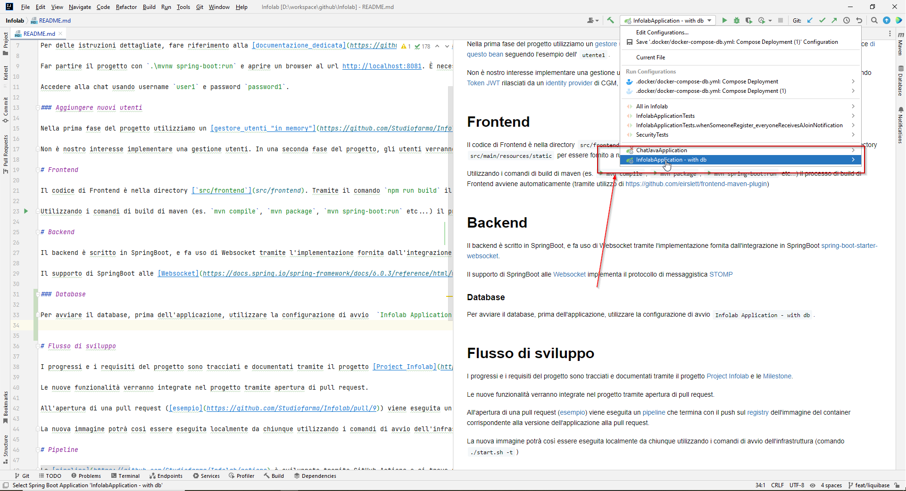

# Getting started

Progetto esteso a partire dal tutorial a questo link https://codefiction.net/building-a-real-time-chat-application-with-spring-boot-and-websocket/

Per delle istruzioni dettagliate, fare riferimento alla [documentazione dedicata](https://github.com/Studiofarma/Infolab/issues/2)

Far partire il progetto con `.\mvnw spring-boot:run` e aprire un browser al url http://localhost:8081. È necessario avere **Java 17** come versione minima

Accedere alla chat usando username `user1` e password `password1`.

### Aggiungere nuovi utenti

Nella prima fase del progetto utilizziamo un [gestore utenti "in memory"](https://github.com/Studiofarma/Infolab/blob/d744591ba9e720ca093626771370c72ce18b195b/src/main/java/com/cgm/infolab/SecurityConfiguration.java#L87). Per aggiungere nuovi utenti alla chat, bisogna modificare il codice [di questo bean](https://github.com/Studiofarma/Infolab/blob/d744591ba9e720ca093626771370c72ce18b195b/src/main/java/com/cgm/infolab/SecurityConfiguration.java#L87) seguendo l'esempio dell' `utente1`.

Non è nostro interesse implementare una gestione utenti. In una seconda fase del progetto, gli utenti verranno infatti autenticati utilizzando [Token JWT](https://jwt.io/) rilasciati da un [identity provider](https://en.wikipedia.org/wiki/Identity_provider) di CGM, noto come Tenant Inventory.

# Frontend

Il codice di Frontend è nella directory [`src/frontend`](src/frontend). Tramite il comando `npm run build` il codice di frontend viene buildato nella directory [`src/main/resources/static`](src/main/resources/static) per essere fornito a runtime dal backend SpringBoot.

Utilizzando i comandi di build di maven (es. `mvn compile`, `mvn package`, `mvn spring-boot:run` etc...) il processo di build di Frontend avviene automaticamente (tramite utilizzo di https://github.com/eirslett/frontend-maven-plugin)

# Backend

Il backend è scritto in SpringBoot, e fa uso di Websocket tramite l'implementazione fornita dall'integrazione in SpringBoot [spring-boot-starter-websocket](https://github.com/Studiofarma/Infolab/blob/d744591ba9e720ca093626771370c72ce18b195b/pom.xml#L76).

Il supporto di SpringBoot alle [Websocket](https://docs.spring.io/spring-framework/docs/6.0.3/reference/html/web.html#websocket) implementa il protocollo di messaggistica [STOMP](https://stomp.github.io/)

- Il controller dei messaggi della Chat e' nel file [ChatController.java](src/main/java/com/cgm/infolab/ChatController.java)
- Un esempio di controller di [Api](https://www.redhat.com/en/topics/api/what-are-application-programming-interfaces) e' nel file [ChatApiMessagesController.java](src/main/java/com/cgm/infolab/ChatApiMessagesController.java)

### Database

Per avviare il database, prima dell'applicazione, utilizzare la configurazione di avvio  `Infolab Application - with db`.

Le configurazioni del database e di PgAdmin sono indicate nel file [docker-compose-db.yml](.docker/docker-compose-db.yml)

Le impostazioni di connessione al database utilizzata dalla nostra Applicazione SpringBoot stanno nel file di configurazione [application.properties](src/main/resources/application.properties)

# Flusso di sviluppo

I progressi e i requisiti del progetto sono tracciati e documentati tramite il progetto [Project Infolab](https://github.com/orgs/Studiofarma/projects/2/views/1) e le [Milestone](https://github.com/Studiofarma/Infolab/milestones).

Le nuove funzionalità verranno integrate nel progetto tramite apertura di pull request.

All'apertura di una pull request ([esempio](https://github.com/Studiofarma/Infolab/pull/9)) viene eseguita un [pipeline](https://github.com/Studiofarma/Infolab/actions/runs/3939529469) che termina con il push sul [registry](https://github.com/Studiofarma/Infolab/pkgs/container/infolab) dell'immagine del container corrispondente alla versione dell'applicazione alla pull request.

La nuova immagine potrà così essere eseguita localmente da chiunque utilizzando i comandi di avvio dell'infrastruttura (comando [`./start.sh -t`](#infrastruttura_parametri))

# Pipeline

La [pipeline](https://github.com/Studiofarma/Infolab/actions) è sviluppata tramite GitHub Actions e si trova nel file [build-and-test.yml](.github/workflows/build-and-test.yml). Al momento [manca uno stage di deploy](https://github.com/Studiofarma/Infolab/issues/11) dell'applicazione. Il deploy avverrà su Virtual machine tramite avvio dello script [`./start.sh`](start.sh) sulla VM stessa.

# Eseguire l'infrastruttura in locale

Richiede l'installazione di [Docker](https://docs.docker.com/desktop/install/windows-install/)

L'infrastruttura del progetto e' lanciabile da bash (va bene una git bash se si e' su Windows), utilizzando il comando `./start.sh`.

Lo script `start.sh` utilizza **Docker compose** per eseguire la configurazione definita nel file [docker-compose.yml](.docker/docker-compose.yml)

Come default verranno esposte le seguenti applicazioni:
 - Chat http://localhost:40001
 - Kibana dashboard http://localhost:40002

### Parametri principali
Lo script può essere eseguito con i seguenti parametri:
 - `-b` (no argomenti): prima di eseguire l'infrastruttura, esegue il build dell'immagine Docker della chat, utilizzando il workspace locale
 - `-p porta_di_destinazione (es: ./start.sh -p 40010)`: esegue l'infrastruttura esponendo la chat sulla porta indicata. Se la porta selezionata fosse già occupata, i servizi verranno stoppati per avviare la nuova versione
 - `-t tag` (es. `./start.sh -t 0.0.0-test`) esegue l'infrastruttura scaricando dal [container registry](https://github.com/Studiofarma/Infolab/pkgs/container/infolab) l'immagine della chat corrispondente al tag indicato
